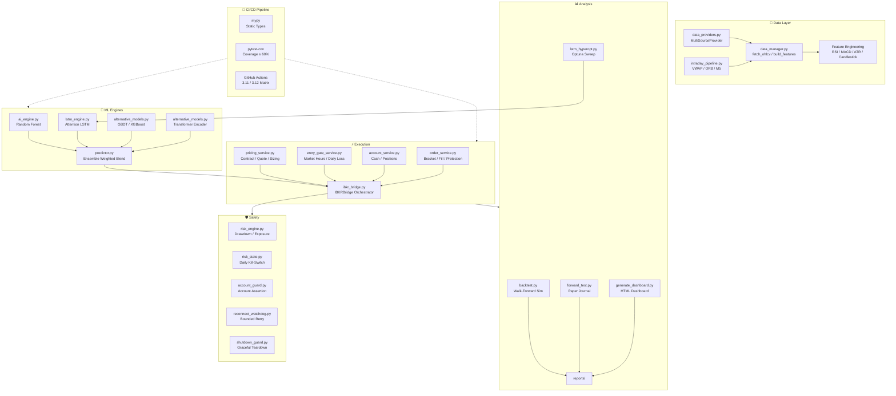

# Stock Engine Pro V3 — Architecture

## Layer Overview

| Layer | Key Files | Responsibility |
|-------|-----------|----------------|
| **Data** | `data_providers.py`, `data_manager.py`, `intraday_pipeline.py` | Multi-source fetch (yfinance/IBKR/Polygon), caching, feature engineering, VWAP/ORB/M5 |
| **ML Engines** | `ai_engine.py`, `lstm_engine.py`, `alternative_models.py` | RF, Attention LSTM, XGBoost/GBDT, Transformer — each with atomic save, per-symbol fallback, walk-forward CV |
| **Ensemble** | `predictor.py` | Weighted blend with missing-model detection, model-gate safety, confidence→BUY/HOLD/SELL |
| **Execution** | `ibkr_bridge.py`, `pricing_service.py`, `entry_gate_service.py`, `account_service.py`, `order_service.py` | Broker orchestration, quote validation, entry gates, bracket orders, fill verification, GTC/OCA protection |
| **Analysis** | `backtest.py`, `forward_test.py`, `expectancy.py`, `generate_dashboard.py` | Walk-forward backtest, paper journal, R-multiple expectancy, HTML dashboard |
| **Safety** | `risk_engine.py`, `risk_state.py`, `account_guard.py`, `reconnect_watchdog.py` | Drawdown halt, daily loss kill-switch, account-type assertion, bounded reconnect |
| **CI/CD** | `.github/workflows/ci.yml`, `pyproject.toml`, `requirements-dev.txt` | mypy type checking, pytest coverage gate ≥ 60%, matrix build 3.11/3.12 |
